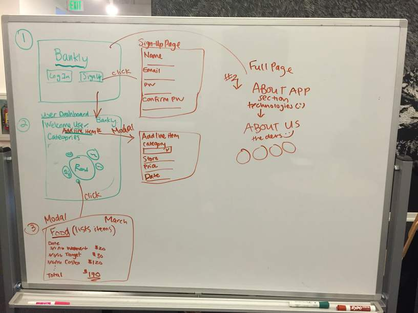
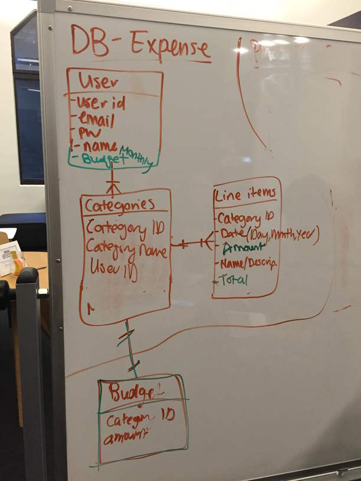

#Bankly
**Technologies Used**

* HTML5/CSS3 
* SASS
* JavaScript
* Ruby on Rails
* Bootstrap
* jQuery
* Chart.js
* fullPage.js
* Cloudinary
* Font Awesome
* Google Fonts
* Heroku
* GitHub

**General Approach**

* Brainstormed as a group, and agreed on an app idea
* Created wireframes for the front end and data base schema 
* Assigned roles within the group 
* Practiced pair programming to create the foundation of the app
* Created databases 
* Built the routes/controllers to address functionality in the app
* Implemented user authentication
* Connected backend data to front end in order to display charts
* Branched off and worked individually on different functionalities on the app
* Committed frequently and addressed merge conflicts

**User stories**

* As a user I want to be able to record and have visual representation of my spending.
* As a user I want to be able to record and visualize my spending across many months.
* As a user I want to keep organized and be able to add, edit, and delete my monthly purchases.

**Unsolved problems**

**Major Hurdles**
* Discovering why our production environment and test environment were inconsistent
* Writing user uploads to the user database while rendering correctly using Cloudinary
*  Accessing the users database(which holds existing information) and adding more user information without deleting the users account
* Overriding bootstrap styles

